<p align="center">
  
</p>

<h1 align="center">CodeCraftX</h1>

<p align="center">
  <strong>Yetenek ve Fırsatları Akıllıca Buluşturan Yeni Nesil HR Platformu</strong>
</p>

<p align="center">
  
</p>

<p align="center">
  <em>CodeCraftX ana sayfa — Yetenek ve Fırsatları Akıllıca Buluşturun</em>
</p>

---

# CodeCraftX

**Yetenek ve Fırsatları Akıllıca Buluşturan Yeni Nesil HR Platformu**

CodeCraftX, geliştiricileri CV analizi ve beceri eşleştirme algoritması ile en uygun kariyer fırsatlarıyla buluşturan, yapay zeka destekli eşleştirme sistemi sunan bir kariyer ve işe alım platformudur.

---

## 🎯 CodeCraftX Hakkında

### 💡 Değer Önerimiz

CodeCraftX, yetenek ile fırsatı doğru eşleştirmeyi hedefler. Geliştiricilerin becerileri ve deneyimi, işverenlerin aradığı profillerle otomatik ve şeffaf biçimde eşleştirilir. Böylece hem adaylar en uygun iş ilanlarına kısa sürede ulaşır hem de işverenler doğru yeteneklere daha verimli erişir.

Platform, geliştirici, işveren ve insan kaynakları ekipleri için tek bir merkez sunar. Yapay zeka destekli eşleştirme sayesinde süreç hızlanır, başvuru kalitesi artar ve taraflar zaman kaybetmeden birbirine ulaşır. Doğru yetenek–fırsat eşleşmesi, zaman tasarrufu ve şeffaf süreçler CodeCraftX'in temel çıktılarıdır.

Bu bölümde teknik detaylara girilmez; odak noktamız ürünün hedefi ve kullanıcıya sağladığı faydadır.

---

## 👥 Kime Hitap Ediyoruz

### 👩‍💻 Geliştiriciler

CodeCraftX, yazılım geliştiricilerin kariyer yolculuğunu kolaylaştırır. Platformda profil ve CV oluşturabilir, yeteneklerinizi ekleyebilir ve eşleşen iş ilanlarını tek ekrandan takip edebilirsiniz. Yapay zeka destekli eşleştirme, sizin için uygun fırsatları öne çıkarır. İş ilanlarına tek tıkla başvurabilir, projelerinizi paylaşabilir ve blog yazılarıyla görünürlüğünüzü artırabilirsiniz. Başvurularınız ve eşleşmeleriniz merkezi bir panelden yönetilir.

### 🏢 İşverenler ve İnsan Kaynakları

Şirketler ve İK ekipleri CodeCraftX üzerinden şirket kaydı oluşturup iş ilanı açabilir. Platform, ilan kriterlerinize uygun adayları beceri ve deneyim bazında eşleştirir. Eşleşen adayları liste halinde görür, başvuruları tek yerden değerlendirir ve süreci hızlandırırsınız. Rol bazlı yetkilendirme ile farklı ekip üyeleri kendi alanlarına uygun işlemleri yapabilir.

### ⚙️ Platform Yönetimi

CodeCraftX, geliştirici, İK, şirket ve platform yöneticisi rolleriyle çok katmanlı bir yapı sunar. Her rol kendi paneline erişir; canlı destek sohbeti ve destek talepleri ile kullanıcılar yardım alabilir. Güvenlik ve gizlilik, rol bazlı erişim ve güvenli kimlik doğrulama ile sağlanır.

---

## ✨ Öne Çıkan Özellikler

|  | Alan | Açıklama |
|:---:|---|----------|
| 🔐 | **Kimlik ve güvenlik** | Güvenli giriş, kayıt ve sosyal giriş (Google vb.) ile tek hesap üzerinden platform kullanımı. |
| 👤 | **Roller** | Geliştirici, İK, Şirket ve Platform Admin — her rol için ayrı dashboard ve yetkiler. |
| 🎯 | **Eşleştirme** | Yapay zeka destekli yetenek–ilan eşleştirme; geliştiriciler uygun fırsatları, işverenler uygun adayları görür. |
| 💬 | **Destek** | Canlı destek sohbeti ve destek talepleri ile kullanıcılar hızlı yanıt alır. |
| 🎨 | **Arayüz** | Modern, erişilebilir ve mobil uyumlu arayüz; karanlık mod desteği. |
| 📝 | **Formlar ve doğrulama** | Tüm formlar tutarlı doğrulama kuralları ile güvenli ve hatasız veri girişi sağlar. |
| 📄 | **Blog ve projeler** | Geliştiriciler blog yazısı yayınlayabilir, proje ekleyebilir ve proje katılım isteği gönderebilir. |

---

## 🔄 Nasıl Çalışır

CodeCraftX'te akış iki ana taraf etrafında şekillenir: **geliştirici** ve **işveren**. Geliştirici kayıt olur, CV ve profilini doldurur, yeteneklerini ekler. Platform bu bilgileri kullanarak uygun iş ilanlarıyla eşleştirme yapar. Geliştirici eşleşen ilanlara başvurabilir; ayrıca blog yazıları yazabilir ve projelerini paylaşabilir. İşveren tarafında şirket kaydı yapılır, iş ilanı açılır; platform eşleşen adayları listeler ve başvurular buradan yönetilir. Süreç özetle: **İş ilanı açma → Eşleşme → Başvuru → Değerlendirme**.

Aşağıdaki diyagram ana akışı özetler:

```mermaid
flowchart LR
  subgraph gelistirici [Geliştirici]
    Kayit[Kayıt]
    CV[CV / Profil]
    Eslesme[Eşleşmeler]
    Basvuru[Başvurular]
    Blog[Blog Yazıları]
    Projeler[Projeler]
  end
  subgraph isveren [İşveren]
    Ilan[İş İlanları]
    Aday[Adaylar]
  end
  Kayit --> CV
  CV --> Eslesme
  Eslesme --> Basvuru
  CV --> Blog
  CV --> Projeler
  Ilan --> Aday
  Eslesme -.-> Ilan
```



---

## 🛠️ Teknoloji

CodeCraftX, modern web teknolojileri ile geliştirilmiştir. Ana mesaj ve ürün hedefi ön planda tutulmuş; aşağıda kullandığımız teknik altyapı özetlenmiştir.

<p align="center">
  <a href="https://nextjs.org"></a>
  <a href="https://www.typescriptlang.org"></a>
  <a href="https://supabase.com"></a>
  <a href="https://tailwindcss.com"></a>
</p>

| Katman | Teknoloji |
|--------|-----------|
| **Framework** | Next.js 16 (App Router, Server Actions) |
| **Dil** | TypeScript |
| **Stil** | Tailwind CSS |
| **UI bileşenleri** | shadcn/ui (Radix tabanlı) |
| **Backend / Auth / Veritabanı** | Supabase |
| **Form yönetimi ve doğrulama** | React Hook Form + Zod |

---

## 🚀 Hızlı Başlangıç

Projeyi yerel ortamda çalıştırmak için aşağıdaki adımları izleyin.

```bash
git clone <repo-url>
cd CodeCraftX
npm install
cp .env.example .env.local   # Supabase URL ve anon key'i doldur
npm run dev
```

Tarayıcıda **http://localhost:3000** adresini açın.

### 🔑 Ortam Değişkenleri

| Değişken | Açıklama |
|----------|----------|
| `NEXT_PUBLIC_SUPABASE_URL` | Supabase proje URL |
| `NEXT_PUBLIC_SUPABASE_ANON_KEY` | Supabase anon (public) key |
| `SUPABASE_SERVICE_ROLE_KEY` | Opsiyonel; şirket/HR API ve cron için sunucu tarafında |
| `CV_PARSE_USE_MOCK` | `true` ise ve ortam `NODE_ENV=test`/`DENO_ENV=test` olduğunda CV parse mock verisi kullanılır |

---

## 📋 Komutlar

| Komut | Açıklama |
|-------|----------|
| `npm run dev` | Geliştirme sunucusu (http://localhost:3000) |
| `npm run build` | Prodüksiyon build |
| `npm run start` | Prodüksiyon sunucusu |
| `npm run lint` | ESLint kontrolü |

---

## 📁 Proje Yapısı

```
CodeCraftX/
├── app/
│   ├── (main)/          # Ana sayfa, landing, blog, projeler, terimler vb.
│   ├── auth/            # Giriş, kayıt, şifre sıfırlama
│   ├── dashboard/       # Rol bazlı dashboard (gelistirici, ik, company, admin)
│   └── api/             # API routes
├── components/          # UI bileşenleri (chat, sidebar, header, home sections vb.)
├── lib/                 # Supabase client, utils, types, glossary
├── hooks/               # useAuth, useChat, useNotifications vb.
├── public/              # Statik dosyalar (logo, hero görseli vb.)
└── scripts/             # Supabase SQL migration / RLS scriptleri
```

---

## 📄 Lisans

[MIT](LICENSE)
